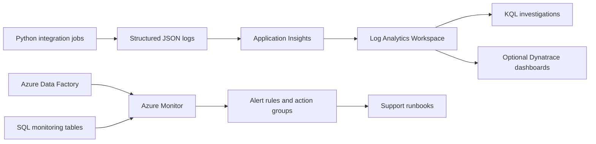

# edm-observability-azure-monitor-kit

[](https://github.com/corzosoft/edm-observability-azure-monitor-kit/actions/workflows/ci.yml)
[](LICENSE)
[](pyproject.toml)

An open-source observability starter kit for **EDM-style Azure data platforms**. It shows how to monitor batch jobs, Azure Data Factory pipelines, Python integrations, SQL jobs, missing files, data quality exceptions, SLA breaches, and downstream distribution failures.

The project runs locally without Azure credentials. Azure Monitor, Application Insights, and Dynatrace integrations are represented through clean patterns, sample KQL, Bicep templates, and documentation.

## Who This Is For

- Data platform engineers adding observability to batch pipelines.
- Azure engineers designing Log Analytics, Application Insights, and alert rules.
- Support teams building runbooks for reference data operations.
- Architects modernizing legacy data platforms into Azure.

## What You Can Do With It

- Run sample Python jobs that emit structured JSON logs.
- Generate correlation IDs and W3C-style `traceparent` values.
- Review SQL monitoring tables for batch, source file, DQ, SLA, and distribution status.
- Use KQL examples for failed jobs, missing files, slow jobs, DQ spikes, SQL latency, and trace drilldowns.
- Adapt Bicep templates for Log Analytics, Application Insights, action groups, and alert rules.
- Use runbooks and alert docs as starting points for production support.

## Architecture



## Quick Start

```powershell
git clone https://github.com/corzosoft/edm-observability-azure-monitor-kit.git
cd edm-observability-azure-monitor-kit
python -m venv .venv
.\.venv\Scripts\Activate.ps1
python -m pip install --upgrade pip
python -m pip install -e ".[dev]"
python -m pytest
python -m ruff check .
```

On macOS/Linux, activate the environment with `source .venv/bin/activate`.

## Run Sample Jobs

```powershell
python -m edm_observability.cli run-file-ingestion
python -m edm_observability.cli run-data-quality
python -m edm_observability.cli run-reconciliation --fail
```

Each job prints structured JSON logs with these fields:

- `job_name`
- `job_status`
- `correlation_id`
- `traceparent`
- `source_system`
- `record_count`
- `validation_failure_count`
- `duration_ms`
- `error_message`

Example failed job:

```json
{
  "correlation_id": "33333333-3333-3333-3333-333333333333",
  "duration_ms": 1.2,
  "environment": "local",
  "event_name": "job_completed",
  "job_name": "file_ingestion",
  "job_status": "FAILED",
  "level": "ERROR",
  "record_count": 0,
  "source_system": "SYNTH_VENDOR_A",
  "traceparent": "00-33333333333333333333333333333333-1111111111111111-01",
  "validation_failure_count": 0
}
```

## SQL Monitoring Tables

Start SQL Server locally:

```powershell
docker compose up -d
```

Apply scripts from `sql/` in numeric order. They create monitoring tables for:

- Batch run status.
- Source file arrival.
- Data quality exceptions.
- SLA targets.
- Downstream distribution status.

## KQL Library

| Query | Use |
| --- | --- |
| `failed_pipeline_runs.kql` | Find failed or cancelled ADF activities. |
| `slow_batch_jobs.kql` | Detect slow jobs from structured logs. |
| `missing_file_alert.kql` | Alert on expected files that did not arrive. |
| `data_quality_exceptions.kql` | Find high exception counts by source, rule, and severity. |
| `sql_dependency_latency.kql` | Investigate SQL dependency latency from Application Insights. |
| `downstream_distribution_failures.kql` | Find failed downstream extracts. |
| `end_to_end_correlation_trace.kql` | Trace one incident by correlation ID. |

## Azure Deployment Pattern

The `infra/bicep` folder contains starter templates for:

- Log Analytics Workspace.
- Application Insights.
- Action Groups.
- Scheduled query alert rules.

Real deployments should connect ADF diagnostic settings, Azure SQL diagnostics, Python OpenTelemetry exporters, and custom SQL monitoring exports to a shared workspace.

## Dynatrace Coexistence

The `dynatrace/` folder explains how Azure Monitor and Dynatrace can coexist:

- Azure Monitor for Azure-native diagnostics and KQL.
- Dynatrace for cross-platform service health and enterprise dashboards.
- Correlation IDs and OpenTelemetry-compatible fields as the bridge.

## Production Boundaries

Before production use, add:

- Managed identity and secure exporter configuration.
- Private networking and workspace access controls.
- Alert severity mapping and escalation routing.
- Noise reduction and suppression windows.
- Real retention, compliance, and incident management process.
- Dashboards validated with real operational users.

## Roadmap

- Add optional OpenTelemetry exporter dependency group.
- Add Azure Monitor workbook template.
- Add sample ADF diagnostic setting Bicep.
- Add synthetic heartbeat job.
- Add richer JSON schema validation for emitted logs.

## Contributing

Contributions are welcome. See [CONTRIBUTING.md](CONTRIBUTING.md).

Use fake telemetry only. Do not submit real production logs, incident data, credentials, or customer identifiers.
