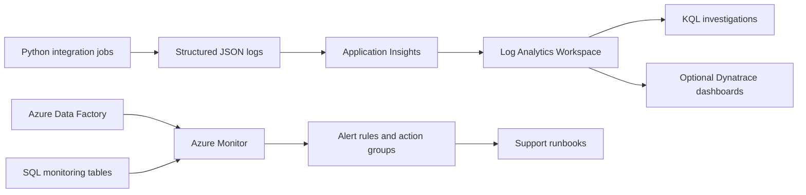

# edm-observability-azure-monitor-kit

An open-source observability starter kit for **EDM-style Azure data platforms**. It demonstrates how teams can monitor batch jobs, Azure Data Factory pipelines, Python integrations, SQL jobs, missing files, data quality exceptions, SLA breaches, and downstream distribution failures during enterprise data platform modernization.

This project uses fake local examples only. It does not require Azure credentials to run locally, and it does not include proprietary vendor internals or real financial data.

## Architecture



## Local Setup

```powershell
cd edm-observability-azure-monitor-kit
python -m venv .venv
.\.venv\Scripts\Activate.ps1
python -m pip install --upgrade pip
python -m pip install -e ".[dev]"
pytest
ruff check .
```

Run sample jobs. They print structured JSON logs with correlation IDs:

```powershell
python -m edm_observability.cli run-file-ingestion
python -m edm_observability.cli run-data-quality
python -m edm_observability.cli run-reconciliation --fail
```

Start local SQL Server for the monitoring table scripts:

```powershell
docker compose up -d
```

Apply scripts from `sql/` in numeric order.

## Sample Log

```json
{
  "correlation_id": "33333333-3333-3333-3333-333333333333",
  "duration_ms": 1.2,
  "environment": "local",
  "event_name": "job_completed",
  "job_name": "file_ingestion",
  "job_status": "FAILED",
  "level": "ERROR",
  "record_count": 0,
  "source_system": "SYNTH_VENDOR_A",
  "validation_failure_count": 0,
  "traceparent": "00-33333333333333333333333333333333-1111111111111111-01"
}
```

## KQL Coverage

- Failed pipeline runs.
- Slow batch jobs and SLA breaches.
- Missing source files.
- High data quality exception counts.
- SQL dependency latency.
- Downstream distribution failures.
- End-to-end trace by correlation ID.

Example:

```kql
AppTraces
| extend payload = parse_json(Message)
| where tostring(payload.event_name) == "job_completed"
| where tostring(payload.job_status) == "FAILED"
| project TimeGenerated, job_name=tostring(payload.job_name), correlation_id=tostring(payload.correlation_id)
```

## Azure Monitoring Pattern

The Bicep templates in `infra/bicep` show reference resources for:

- Log Analytics Workspace.
- Application Insights.
- Action Groups.
- Scheduled query alert rules.

Real deployments should wire Python OpenTelemetry exporters, ADF diagnostic settings, Azure SQL diagnostic settings, and custom SQL monitoring exports into the same workspace.

## How This Supports EDM Modernization

Legacy data platforms often have strong processing logic but weak operational visibility. During Azure migration, teams need to prove not only that data matches, but that the new platform is supportable. This kit demonstrates correlation, alerting, runbooks, SLA/SLO thinking, KQL investigations, and coexistence with Dynatrace.

## Interview Talking Points

- Correlation IDs across Python, ADF, SQL, and downstream distribution.
- Structured logs as the contract between application code and Azure Monitor.
- KQL as the support-team investigation layer.
- SQL monitoring tables for operational state and audit-friendly reporting.
- Alert rules that map to runbooks, not just noisy notifications.
- Azure Monitor and Dynatrace coexistence in hybrid enterprise estates.
